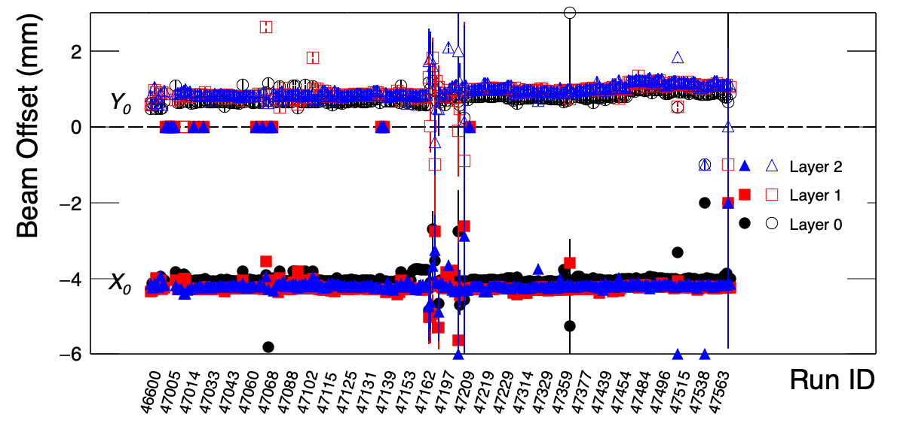

===== Instructions to files in this directory =====

Use MVTX cluster phi dependence distributions to calibrate beam position w.r.t the MVTX center.

1) Input needed:
- QA histograms (format from Hao-Ren), saves in root/ directory

2) To analyze a single run, do "root 'fitBL.C(${RUN})'  (replace ${RUN} with the Run ID)

3) To analyze a list of runs, prepare a run list saved in run.list file. Then run ./anaBL.sh figures saved in fig/ directory while beam position data saved in dat/ directory
